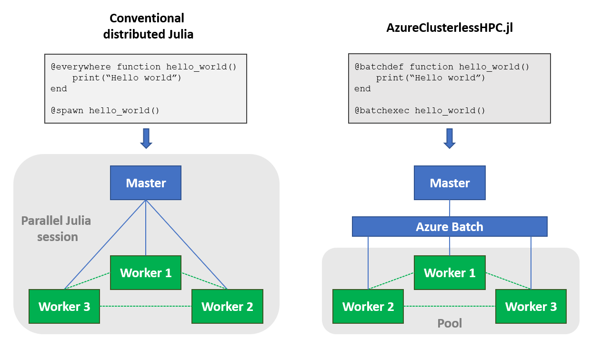
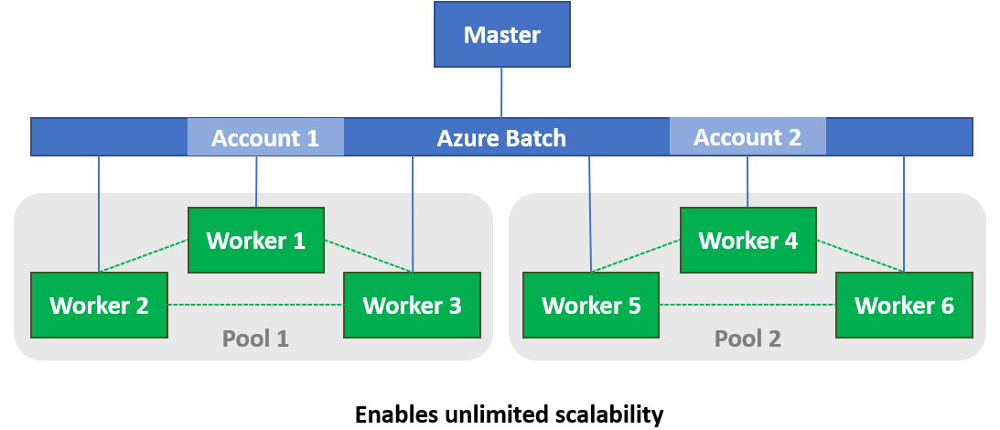

# AzureClusterlessHPC.jl

## Overview

**AzureClusterlessHPC.jl** is a package for simplified parallel computing in the cloud. AzureClusterlessHPC.jl borrows the syntax of [Julia's Distributed Programming](https://docs.julialang.org/en/v1/stdlib/Distributed/) package to easily execute parallel Julia workloads in the cloud.

Unlike traditional distributed programming in Julia, you do not need create a cluster of interconnected nodes with a parallel Julia session running on them. Instead, `AzureClusterlessHPC.jl` allows you to create one or multiple pools of virtual machines (VMs) on which you can remotely execute Julia functions:

The advantage is that you can scale almost indefinitely, as you elliminate the master worker as a bottleneck that needs to communicate with an increasing number of workers. Instead, you run on a single Julia worker that schedulers and executes workloads through one or multiple Azure Batch clients. The underlying resources are managed by the cloud and can dynamically shrink and grow at any time:

Each pool can have up to 2,000 individual nodes or up to 100 interconnected nodes. Pools with interconnected nodes allow you to run MPI or distributed Julia code within a single pool and you can run multiple MPI function across many pools.

## Troubleshooting

If you encounter any problems or errors, please file a github issue [here](https://github.com/microsoft/AzureClusterlessHPC.jl/issues).
